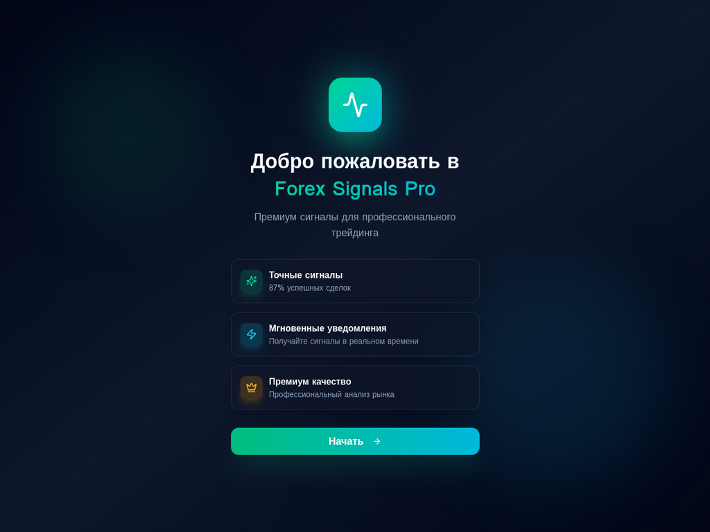
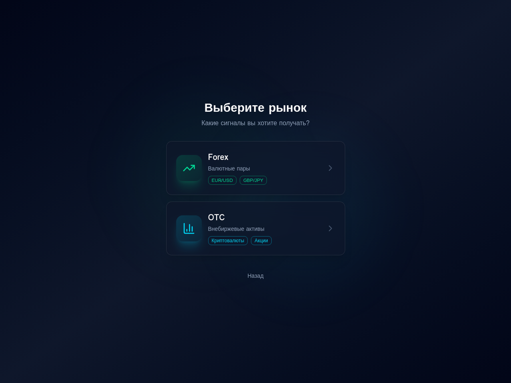
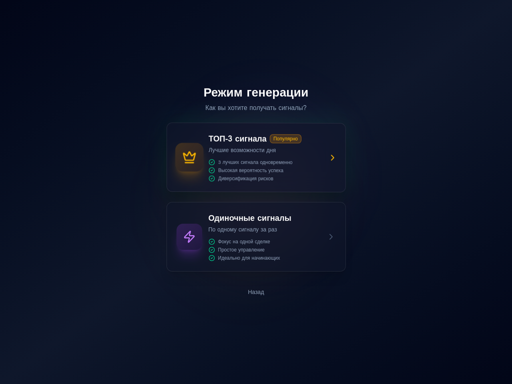
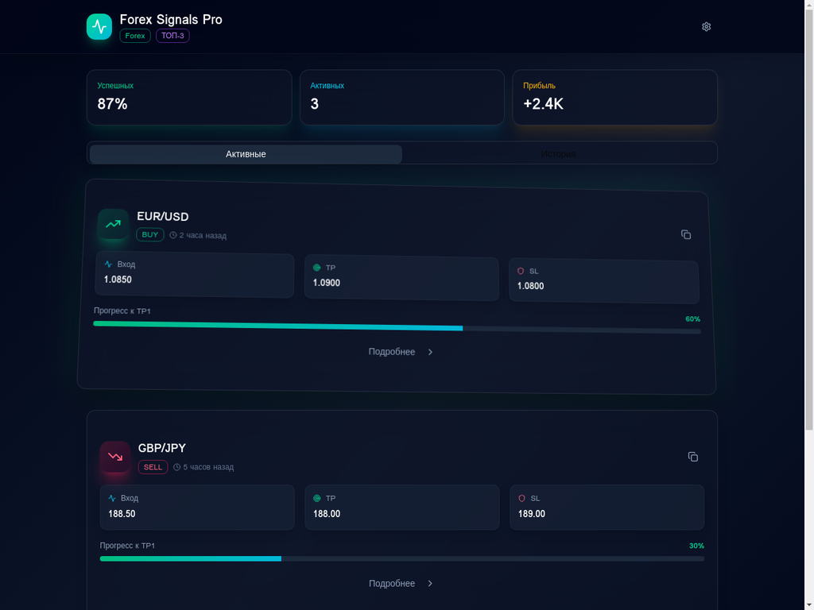
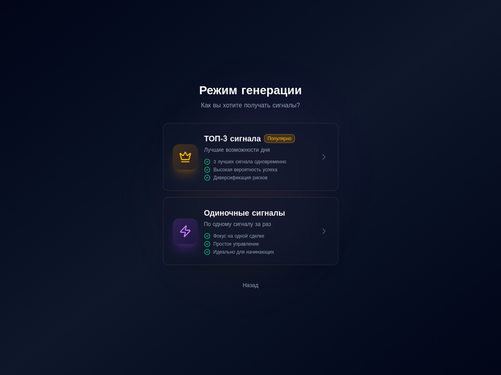
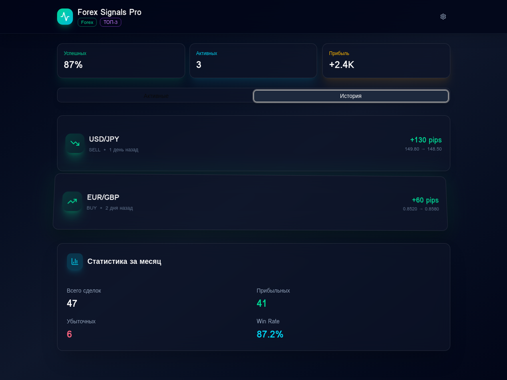

# Презентация Telegram Mini App: Forex Signals Pro

## Введение

Это веб-приложение (Telegram Mini App) разработано для вашего Telegram-бота с сигналами по форекс рынку. Оно отличается современным, минималистичным дизайном с премиальным внешним видом, интуитивно понятным интерфейсом и интерактивными 3D-эффектами.

## 1. Приветственный экран

**Описание:** Первый экран, который видит пользователь. Представляет приложение, его ключевые преимущества и предлагает начать работу.

**Особенности:**
*   Привлекательный дизайн с анимированными фоновыми элементами.
*   Четкое позиционирование продукта: "Премиум сигналы для профессионального трейдинга".
*   Интерактивные карточки с описанием преимуществ (точные сигналы, мгновенные уведомления, премиум качество).
*   Кнопка "Начать" для перехода к следующему шагу.

## 2. Экран выбора рынка

**Описание:** Позволяет пользователю выбрать тип рынка, для которого он хочет получать сигналы: Forex или OTC.

**Особенности:**
*   Интуитивно понятный выбор с помощью интерактивных карточек.
*   Визуальное разделение рынков с соответствующими иконками и примерами активов.
*   Плавные переходы и 3D-эффекты при наведении.

## 3. Экран выбора режима генерации

**Описание:** Пользователь выбирает, как он хочет получать сигналы: "ТОП-3 сигнала" или "Одиночные сигналы".

**Особенности:**
*   Четкое описание преимуществ каждого режима.
*   Индикация "Популярно" для режима "ТОП-3 сигналов".
*   Иконки и 3D-эффекты для каждого варианта.

## 4. Главный экран: Активные сигналы (ТОП-3 режим)

**Описание:** Основной экран приложения, отображающий активные сигналы в режиме "ТОП-3".

**Особенности:**
*   Сводная статистика в верхней части (успешных сделок, активных сигналов, прибыль).
*   Вкладки "Активные" и "История" для навигации.
*   Каждая карточка сигнала содержит: валютную пару, тип сделки (BUY/SELL), точки входа, TP, SL, статус и время.
*   Индикатор прогресса к TP1 для активных сигналов.
*   Кнопка "Копировать" для быстрого копирования параметров сигнала.
*   3D-эффекты и интерактивность для карточек сигналов.

## 5. Главный экран: Активные сигналы (Одиночный режим)

**Описание:** Основной экран приложения, отображающий активные сигналы в режиме "Одиночные сигналы". В этом режиме отображается только один активный сигнал.

**Особенности:**
*   Аналогичен ТОП-3 режиму, но сфокусирован на одном сигнале.
*   Показывает, что приложение адаптируется под выбранный режим.

## 6. Главный экран: История сигналов

**Описание:** Вкладка "История" на главном экране, показывающая закрытые сигналы и общую статистику.

**Особенности:**
*   Список закрытых сигналов с указанием результата (прибыль/убыток).
*   Сводная статистика за месяц (всего сделок, прибыльных, убыточных, Win Rate).
*   Интерактивные карточки с 3D-эффектами.

## Заключение

Это Telegram Mini App предоставляет пользователям удобный и визуально привлекательный способ взаимодействия с вашим ботом по форекс сигналам. Современный дизайн, 3D-эффекты и интуитивная навигация создают премиальный пользовательский опыт.
